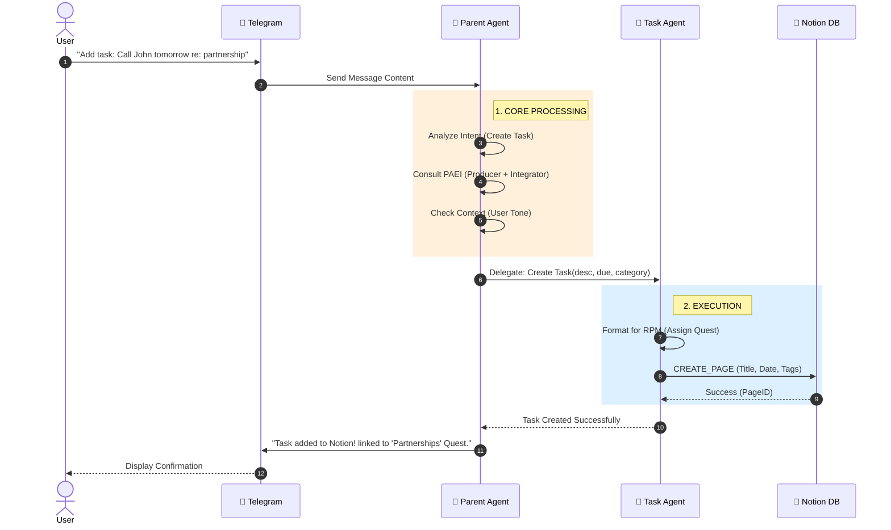
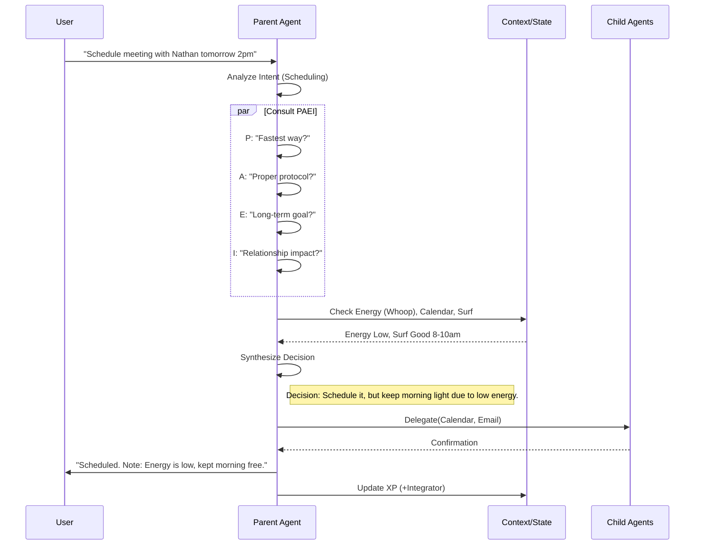
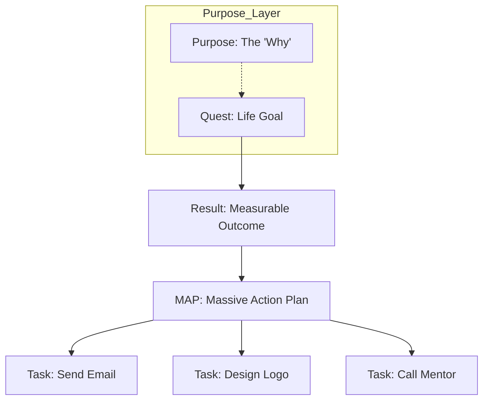

# Present Operating System (POS) - System Specification & Architecture

## 1. Core Philosophy & Overview

**Present Operating System (POS)** is an AD-HD optimized, AI-driven personal management platform designed to automate decision-making and scheduling. It operates as a co-designed, agentic system where the user and AI collaborate to design the user’s life/work schedule, continuously adapting to real-time data to optimize daily activities.

### Key Philosophical Pillars
*   **ADHD Flow Optimization**: Frictionless access and automation to enable sustained creative flow.
*   **PAEI Balanced Decision-Making**: Decisions are evaluated through Producer, Administrator, Entrepreneur, and Integrator lenses.
*   **RPM Goal Alignment**: All tasks linked to Results, Purpose, and Massive Action Plans.
*   **Frictionless, Multi-Modal Access**: Voice, text, chat, web, mobile, telegram, whatsapp.
*   **Proactive & Context-Aware**: Anticipatory adjustments based on energy, weather, and patterns.

---

## 2. System Architecture

POS is built on a **Parent-Child Agent Swarm Architecture**. A central Parent Agent orchestrates specialized Child Agents, ensuring a unified user interface while maintaining modular functionality.

### High-Level Architecture Diagram


```mermaid
graph TD
    %% Styling
    classDef user fill:#f9f,stroke:#333,stroke-width:2px;
    classDef interface fill:#d4e1f5,stroke:#333,stroke-width:1px;
    classDef core fill:#ffe6cc,stroke:#d79b00,stroke-width:2px;
    classDef agent fill:#e1d5e7,stroke:#9673a6,stroke-width:1px;
    classDef db fill:#dae8fc,stroke:#6c8ebf,stroke-width:2px,shape:cylinder;
    classDef ext fill:#f5f5f5,stroke:#666,stroke-width:1px,stroke-dasharray: 5 5;

    User((User)):::user
    
    subgraph Interfaces [" 📱 User Interfaces "]
        direction TB
        Tele[Telegram Bot]:::interface
        Voice[Voice / Shortcuts]:::interface
        Web[Web / Mobile Dashboard]:::interface
    end
    
    User --> Tele
    User --> Voice
    User --> Web

    subgraph System [" 🧠 Present OS Intelligence "]
        direction TB
        Parent[Parent Agent<br/>(Orchestrator)]:::core
        
        subgraph Logic [" Decision Engine "]
            NLU[NLU & Intent]:::core
            PAEI[PAEI Framework]:::core
            RPM[RPM Goals]:::core
        end
        
        Parent <--> Logic

        subgraph Swarm [" 🤖 Child Agent Swarm "]
            Email[Email Agent]:::agent
            Cal[Calendar Agent]:::agent
            Task[Task Agent]:::agent
            Meet[Meeting Agent]:::agent
            Fin[Finance Agent]:::agent
            XP[XP Agent]:::agent
        end
        
        Parent --> Swarm
    end
    
    Interfaces --> Parent
    
    subgraph Data [" 💾 Data & Memory "]
        Notion[(Notion Database<br/>Tasks, Quests, CRM)]:::db
        Vector[(Vector DB<br/>Context & Memory)]:::db
    end

    Swarm --> Notion
    Swarm --> Vector
    Parent --> Vector

    subgraph External [" 🌐 External APIs "]
        Gmail[Gmail API]:::ext
        GCal[Google Calendar]:::ext
        Ffly[Fireflies.ai]:::ext
        Bank[Banking APIs]:::ext
    end

    Email <--> Gmail
    Cal <--> GCal
    Meet <--> Ffly
    Fin <--> Bank
```

### Data Flow: Telegram to Notion (Example)



---

## 3. Component Details

### 3.1. Parent Agent (The Orchestrator)
**Role**: The single point of contact. Receives input, understands intent, consults PAEI, checks context, and delegates.
*   **Responsibilities**:
    *   Natural Language Understanding (NLU).
    *   PAEI Consultation (weighing P, A, E, I perspectives).
    *   Context checking (Energy/WHOOP, Schedules, Weather).
    *   Delegation to Child Agents.
    *   Response synthesis.

### 3.2. Child Agents (Specialized Modules)

| Agent | Functionality | Integrations |
| :--- | :--- | :--- |
| **Email Agent** | Reads, drafts, categorizes emails. Learns tone. | Gmail API |
| **Calendar Agent** | Intelligent scheduling, dynamic rescheduling based on energy/conditions. | Google Calendar |
| **Task Agent** | Creates, categorizes tasks. Links to RPM & Avatars. | Notion |
| **Meeting Agent** | Transcribes meetings, extracts action items & tasks. | Fireflies.ai |
| **Finance Agent** | Tracks budgets, bills, investments. | Monarch, Wealthfront |
| **XP Agent** | Gamification engine. Awards XP per Avatar/PAEI. | Internal/Notion |
| **Weather/Surf** | Checks conditions for environmental decision making. | OpenWeather, Surfline |
| **Browse Agent** | Automates web research and summarization. | Brave API, Browser |
| **Contact Agent** | Manages relationships and contact context. | Notion/Contacts |

### 3.3. Database & Memory


*   **Primary DB (Notion)**: meaningful structured data (Tasks, Quests, XP, CRM).
*   **Vector DB (Pinecone/Chroma)**: Semantic memory for RAG (past context, preferences).

---

## 4. Methodologies & Decision Logic

### 4.1. PAEI Decision-Making Framework


Every decision typically involves a trade-off. The Parent Agent explicitly evaluates:
*   **Producer (P)**: Speed, efficiency, results.
*   **Administrator (A)**: Order, systems, protocol.
*   **Entrepreneur (E)**: Vision, innovation, long-term impact.
*   **Integrator (I)**: People, harmony, culture, well-being.

#### PAEI Decision Flow Diagram



### 4.2. RPM (Rapid Planning Method)
Structure user goals to ensure purpose-driven action.
*   **Quest**: Big life goal (e.g., "Launch Record Label").
*   **Result**: Specific outcome ("$100k revenue").
*   **Purpose**: Why? ("Financial Freedom").
*   **MAP (Massive Action Plan)**: Strategy/Plan.
*   **Task**: Atomic unit of work linked to MAP.

#### RPM Hierarchy Diagram



---

## 5. Example Workflows

### Morning Check Pipeline
1.  **Trigger**: Morning wake-up.
2.  **Data Collection**:
    *   WHOOP: Recovery 35% (Red).
    *   Calendar: 9am Meeting, Deep Work blocks.
    *   Surfline: Excellent conditions 8-10am.
3.  **Proactive Decision**:
    *   *I (Integrator)*: Prioritize health/self.
    *   *E (Entrepreneur)*: Surfing boosts flow/creativity.
    *   *Decision*: Cancel 9am, Surf 8-10am.
4.  **Execution**:
    *   Calendar Agent: Moves 9am meeting, blocks surf slot.
    *   Email Agent: Notifies participant.
    *   Task Agent: Push deep work to afternoon.
5.  **User Notification**: "Morning. Recovery low, Surf is epic. Cleared morning for you."

---

## 6. Future Vision

*   **Multi-User Coordination**: Swarms interacting between different users.
*   **Decentralized Org OS**: DAO-like structures.
*   **Automated Animism**: Syncing with natural cycles (lunar, tides).
